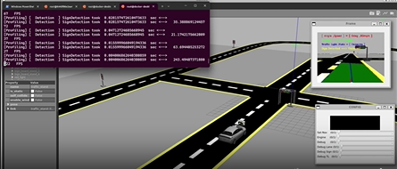

## Kuksa 

[Eclipse Kuksa Quick Start](https://eclipse-kuksa.github.io/kuksa-website/quickstart/)

> **Important Note:** Based on the documentation the original port to publish Kuksa.Val serveris 55555, however it doesn't work, using port 55556 is an alternative.

### Sample Kuksa Project:
```bash
 docker run -it --rm  --publish 55556:55556 ghcr.io/eclipse/kuksa.val/databroker:master  --port 55556 --insecure
```

```bash
# To install Kuksa Python library:
pip install kuksa_client 
```

### A Sample Python Project Creating and Subscribing to a Kafka Topic

```python
#!/usr/bin/env python3

# sample_kuksa.py
# The following project is executed using version 0.4.3

from kuksa_client.grpc import VSSClient
from kuksa_client.grpc import Datapoint

import time

with VSSClient('127.0.0.1', 55556) as client: # Attach to local host port 55556 to listen kuksa.val server
    for speed in range(0, 100):
        client.set_current_values({
            'Vehicle.Speed': Datapoint(speed),
        })
        print(f"Feeding Vehicle.Speed to {speed}")

        # Read back the value to confirm it was set correctly
        response = client.get_current_values(['Vehicle.Speed'])
        if 'Vehicle.Speed' in response:
            read_back_speed = response['Vehicle.Speed'].value
            print(f"Read back Vehicle.Speed: {read_back_speed}")
        else:
            print("Failed to read back Vehicle.Speed")

        time.sleep(1)
print("Finished.")

```

```bash
usr@usr:~$ chmod +x ./sample_kuksa.py
usr@usr:~$ python3 ./sample_kuksa.py

# Expected output:
Feeding Vehicle.Speed to 0
Read back Vehicle.Speed: 0.0
Feeding Vehicle.Speed to 1
Read back Vehicle.Speed: 1.0
Feeding Vehicle.Speed to 2
Read back Vehicle.Speed: 2.0
Feeding Vehicle.Speed to 3
Read back Vehicle.Speed: 3.0
...
```

###  Vehicle Signal Specification (VSS) Datatypes:
Kuksa support VSS data type specification. For detail documentation on VSS data types and definitions please refer to:

- [Vehicle Signal Specification Data Types](https://covesa.github.io/vehicle_signal_specification/rule_set/data_entry/data_types/)

## Autoware 

[Autoware Documentation](https://autowarefoundation.github.io/autoware-documentation/main/installation/autoware/docker-installation/):


```bash
# Clone autowarefoundation/autoware and move to the directory.

git clone https://github.com/autowarefoundation/autoware.git
cd autoware
# The setup script will install all required dependencies with Ansible:

./setup-dev-env.sh -y docker
# To install without NVIDIA GPU support:

./setup-dev-env.sh -y --no-nvidia docker

```


In case you get such error "NVIDIA-SMI has failed because it couldn't communicate with the NVIDIA driver." Please follow the video:

- [NVIDIA-SMI Installation](https://www.youtube.com/watch?v=bhPCjPdqDEM)


TODO TRY: https://www.youtube.com/watch?v=OFWKevbjDPU

https://www.youtube.com/watch?v=iW-a7cKUxuY


For Anakios:

## Install Podman: 

To install Podman on Ubunutu the following tutorial can be followed:
- [Podman Installation](https://docs.vultr.com/how-to-install-podman-on-ubuntu-24-04)
- 
```bash
sudo sh -c "echo 'deb http://download.opensuse.org/repositories/devel:/kubic:/libcontainers:/stable/xUbuntu_${VERSION_ID}/ /' > /etc/apt/sources.list.d/devel:kubic:libcontainers:stable.list"
wget -nv https://download.opensuse.org/repositories/devel:kubic:libcontainers:stable/xUbuntu_${VERSION_ID}/Release.key -O- | sudo apt-key add -
sudo apt-get update -qq
sudo apt-get -qq --yes install podman
```


## Install WSL 
To install WSL the following tutorial can be followed:


## Create OCI Image from Docker Instance (via Docker2OCI tool)

Following tutorial shows the steps on how to convert a Docker image format into OCI image format which Ankaios supports.

- [Docker2OCI](https://github.com/coolljt0725/docker2oci)
  -  Supports Docker2OCI conversion
  -  Supports validation of an Image based on OCI formatting

## Sample Ankaios Project:
- [Ankaios Quick Start](https://eclipse-ankaios.github.io/ankaios/0.1/usage/quickstart/)
- [Sample Fleet Management Project via MQTT Broker](https://eclipse-ankaios.github.io/ankaios/0.5/usage/tutorial-fleet-management/)
> Important Note: A sample Ankaios Project 

```yaml
apiVersion: v0.1
kind: Config
workloads:
  nginx:
    runtime: podman
    agent: agent_A
    restart: true
    updateStrategy: AT_MOST_ONCE
    accessRights: #
      allow: []
      deny: []
    tags:
      - key: owner
        value: Ankaios team
    runtimeConfig: |
      image: docker.io/nginx:latest
      ports:
      - containerPort: 80
        hostPort: 8081
```

```bash
ank-server -k  --startup-config state.yaml # Start ankaios server with  provided configuration
ank -k apply state.yaml # Apply the workload

ank -k  get workload # Get all workload states
ank -k get state # Get detailed state about all workload states
```


## Sample ROS Autonomous Driving Project in Docker

A sample autonomous driving project can be initialized with:

```bash
docker pull noshluk2/ros2-self-driving-car-ai-using-opencv:latest

docker run -it \
    --name=ros2_sdc_container \
    --env="DISPLAY=$DISPLAY" \
    --env="QT_X11_NO_MITSHM=1" \
    --volume="/tmp/.X11-unix:/tmp/.X11-unix:rw" \
    --env="XAUTHORITY=$XAUTH" \
    --volume="$XAUTH:$XAUTH" \
    --net=host \
    --privileged \
    noshluk2/ros2-self-driving-car-ai-using-opencv \
    bash

# Bridging the environment with Prius Car
ros2 launch self_driving_car_pkg world_gazebo.launch.py

# In another terminal run:
 docker exec -it ros2_sdc_container bash

cd ~/ROS2-Self-Driving-Car-AI-using-OpenCV/
ros2 run self_driving_car_pkg computer_vision_node # Self driving mode
```

[](./AutonomousDriving.mp4)

## Autowrx Gitlab Repository
- [Autowrx Repository](https://gitlab.eclipse.org/eclipse/autowrx)
## ThreadX
- [ThreadX - Getting Started](https://github.com/eclipse-threadx/getting-started)
## Uprotocol
- [Eclipse Uprotocol](https://github.com/eclipse-uprotocol)
- [upython](https://github.com/eclipse-uprotocol/up-python)
- [up-transport-zenoh-python](https://github.com/eclipse-uprotocol/up-transport-zenoh-python)
## Influxdb Connection

[Kubernetes InfluxDB Setup](https://medium.com/starschema-blog/monitor-your-infrastructure-with-influxdb-and-grafana-on-kubernetes-a299a0afe3d2)

## TODOS
- [ ] For IOT tracability demonstrate ROS/Autoware topic subscription and data visualization through Influxdb / Grafana 
